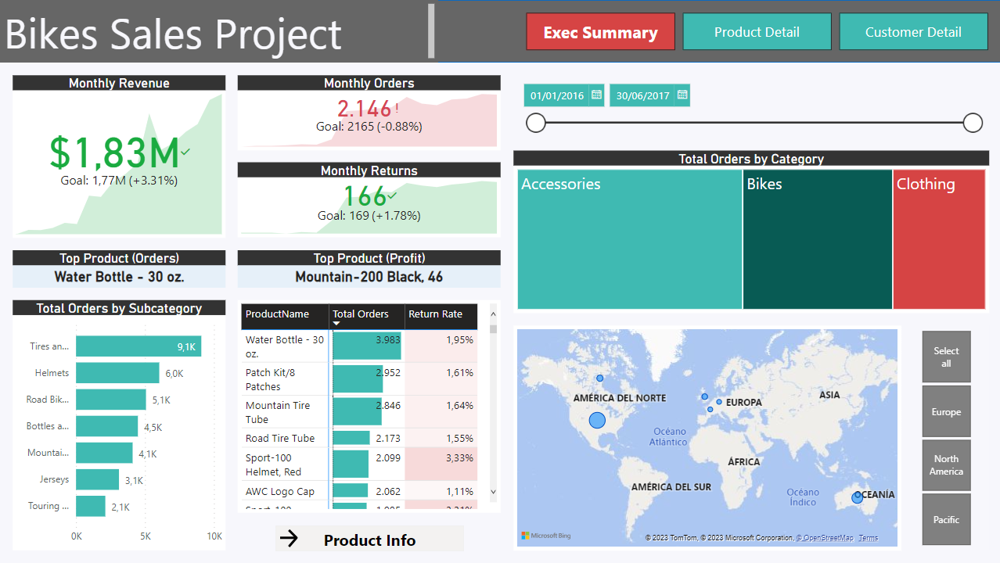
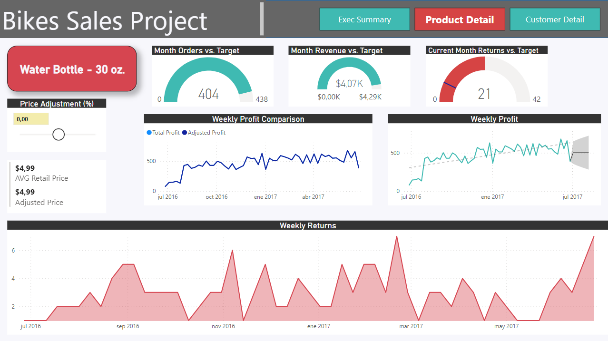
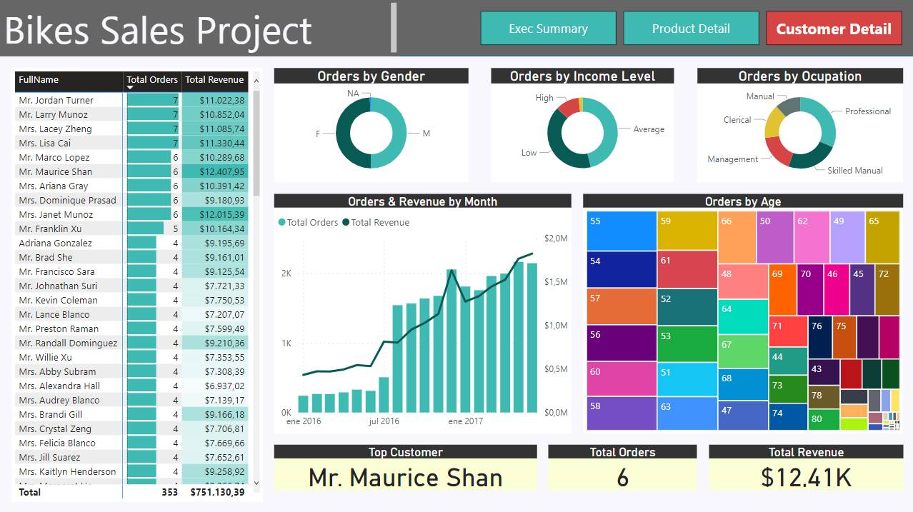

# Bikes_Sales_Analysis_Project

## Objective
Design and deliver an end-to-end business intelligence solution for a global manufacturing company. Track KPIs (sales, revenue, profit, returns), compare regional performance, analyse product-level trends and forecasts, and identify high-value customers.

## Scope
The project was based on a set of raw CSV files containing information about transactions, returns, products, customers, and territories.

## Instruction
- Connect and transform raw data. 
- Build a relational data model. 
- Create new calculated columns and DAX measures. 
- Design an interactive report to analyse and visualize the data.

## Technologies
Power BI

## Preview

